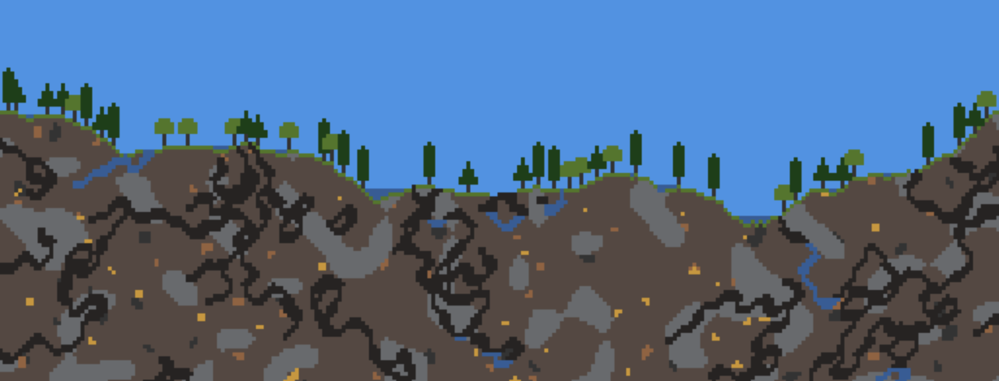

# [rgehan/2d-world-generator](https://github.com/rgehan/2d-world-generator)



This is a basic 2D world generator, implemented in TypeScript. I had the idea for this after playing [MoonQuest](https://playmoonquest.com/).

A live demo is available [here](https://random-2d-map-setkfeqgqm.now.sh/).

It features:
- Height map generation
- Cave generation
- Ores generation
- Trees generation
- Water particles simulation

### Setup

```bash
git clone git@github.com:rgehan/2d-world-generator.git

cd 2d-world-generator/

yarn
```

### Running the generator

```bash
yarn dev
```

### Configuration

#### Map Generation
It takes a few parameters, allowing to generate very different kind of maps:
- `size`, used to determine how wide the map is in term of blocks. The map is `2^size` blocks wide.
- `level`, the base ground level, `0` is the lowest, while `1` is the highest
- `roughness`, how rough the map is. `0` will produce a flat map, while `1` would produce a very rocky map
- `mapHeight`, how high the map is in term of blocks. It's just used when sampling the heightmap function.

### Ore Generation
It takes an array of "steps". A step has a few parameters:
- `blockId`, which kind of block is generated by that step
- `size`, the size of the ore veins (used to scale a Perlin noise function)
- `amount`, the amount of ore in a given vein (used as a threshold for the Perlin noise function)

### Cave Generation
It takes a few parameters; they determine how many and how long the caves are:
- `count`, the initial number of caves
- `forkCapacity`, the number of times a given tunnel can split into two tunnels

### Liquid Generation
Determine the quantity of liquids generated and how good it looks:
- `amount`, the quantity of water generated
- `iterations`, how long the simulations run until we consider all liquid particles to have settled.

### Tree Generation
- `proba`, the probability a given grass tile will yield a tree.
